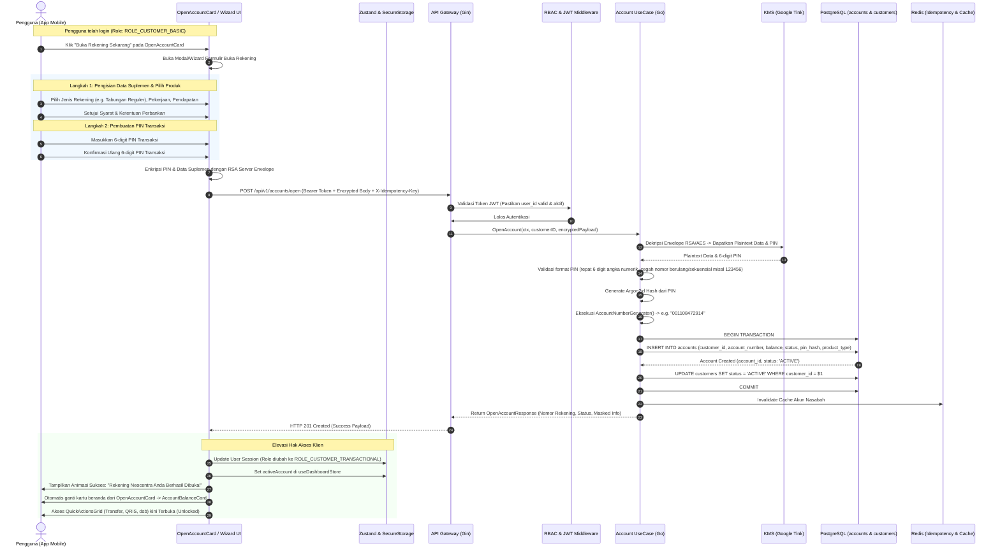

# Neocentra Bank - Account Structure & In-App Onboarding Architecture (v1-as)

Dokumen ini merupakan cetak biru (*architectural blueprint*) dan spesifikasi teknis untuk implementasi **Mekanisme Buka Rekening di Dalam Aplikasi (*In-App Account Opening*)** dengan **Role-Based Access Control (RBAC)** dan **Hierarki Hak Akses Transaksional** pada ekosistem **Neocentra Bank** (`neocentra-bank-mobile` dan `neocentra-bank-be-cs`).

---

## 1. Ringkasan Eksekutif & Filosofi Desain

### 1.1 Latar Belakang & Masalah
Saat ini aplikasi mobile Neocentra Bank telah mengintegrasikan fitur registrasi data nasabah (`customers`) dan autentikasi login (non-transaksional). Pengguna yang telah melakukan login dapat menjelajahi beranda (dashboard), profil, dan informasi promo. Di layar dashboard, telah tersedia kartu ajakan (*call-to-action*) pada komponen [`OpenAccountCard.tsx`](file:///Volumes/iwandev/neocentra-bank/neocentra-bank-mobile/src/modules/dashboard/presentation/components/OpenAccountCard.tsx) dengan tombol **"Buka Rekening Sekarang"**.

Tantangan utama yang diselesaikan dalam arsitektur ini adalah:
1. **Menghindari Kerumitan Super App / Multi-App Eksternal**: Di dunia nyata, beberapa bank menggunakan aplikasi terpisah atau mini-app webview untuk pembukaan rekening (*onboarding*). Neocentra Bank mengadopsi pendekatan **Native Single-App Progression**, di mana satu aplikasi mobile yang ramping melayani siklus hidup pengguna dari calon nasabah biasa hingga menjadi nasabah bertransaksi penuh melalui mekanisme state gating.
2. **Pemisahan Tegas Akses Non-Transaksional vs Transaksional (RBAC)**: Pengguna yang belum memiliki rekening aktif atau belum lolos verifikasi dilarang keras memicu aksi keuangan (Transfer, QRIS, Top Up, Mutasi). Akses ini dikunci baik di sisi klien (UI / Route Guard) maupun di sisi server (API Middleware).
3. **Evolusi Tabel `accounts` & Keamanan PIN Transaksi**: Penambahan kolom nomor rekening (`account_number`), status verifikasi rekening, dan pengelolaan PIN transaksi 6-digit dengan enkripsi berstandar perbankan.

---

## 2. Paradigma Arsitektur: Single App vs Super App

```
┌────────────────────────────────────────────────────────────────────────────────────────┐
│                        TRADISIONAL / SUPER APP PATTERN                                 │
│  [Aplikasi Induk] ───(DeepLink / Webview)───> [Modul KYC Terpisah / 3rd Party App]    │
│  - User Experience terfragmentasi & lambat                                             │
│  - Overhead autentikasi ganda & sinkronisasi token lintas domain                       │
└────────────────────────────────────────────────────────────────────────────────────────┘
                                           ▼
┌────────────────────────────────────────────────────────────────────────────────────────┐
│               NEOCENTRA NATIVE PROGRESSION PATTERN (IN-APP RBAC)                       │
│                                                                                        │
│   [Calon Nasabah / Registered]                                                         │
│         │                                                                              │
│         ├──> Fitur Non-Transaksional (Dashboard Edukasi, Promo, Info Kurs, Profil)     │
│         │                                                                              │
│         └──> Trigger: [Buka Rekening Sekarang] (OpenAccountCard.tsx)                   │
│                    │                                                                   │
│                    ├── In-App KYC Wizard & Data Suplemen                               │
│                    ├── Setup 6-Digit Transaction PIN (RSA Encrypted)                   │
│                    └── Otomatisasi Approval / Core Banking Account Creation            │
│                               │                                                        │
│                               ▼                                                        │
│   [Nasabah Aktif / Verified Account Holder]                                            │
│         │                                                                              │
│         └──> Fitur Transaksional Penuh (Transfer, QRIS, Top Up, Mutasi, Cek Saldo)     │
│              (Memerlukan Verifikasi PIN Transaksi pada Setiap Eksekusi Finansial)      │
└────────────────────────────────────────────────────────────────────────────────────────┘
```

---

## 3. Model Hak Akses (RBAC) & Siklus Hidup Pengguna

### 3.1 Hierarki Peran (Role Hierarchy)

Sistem membagi pengguna ke dalam 3 tingkatan status (*Tiering*):

| Tier | Role / Status | Deskripsi | Akses Fitur |
| :--- | :--- | :--- | :--- |
| **Tier 0** | `GUEST` | Pengguna yang belum login / baru mengunduh aplikasi. | Landing page, Registrasi awal, Login. |
| **Tier 1** | `ROLE_CUSTOMER_BASIC` (Non-Transaksional) | Pengguna telah terdaftar di tabel `customers` dan berhasil login, namun **belum memiliki rekening bank aktif** di tabel `accounts`. | Melihat profil, info perbankan, navigasi dashboard, melihat kartu `OpenAccountCard`, inisiasi pembukaan rekening. Transaksi finansial **DIBLOKIR**. |
| **Tier 2** | `ROLE_CUSTOMER_PENDING_KYC` | Pengguna telah mengajukan pembukaan rekening dan data KYC sedang diproses/ditinjau. | Status pelacakan pembukaan rekening (*Pending Approval*). Transaksi finansial masih diblokir. |
| **Tier 3** | `ROLE_CUSTOMER_TRANSACTIONAL` (Transaksional Penuh) | Nasabah telah memiliki rekening aktif (`accounts.status = 'ACTIVE'`) dan telah membuat PIN Transaksi 6-digit yang valid. | Akses penuh ke seluruh fitur: Transfer, QRIS, Top Up, Mutasi, Manajemen Kartu, dan Kartu Saldo (`AccountBalanceCard`). |

### 3.2 Matriks Hak Akses (Permission Matrix)

```text
Fitur / Tindakan              GUEST    BASIC (Non-Tx)    PENDING_KYC    TRANSACTIONAL
───────────────────────────────────────────────────────────────────────────────────────
Lihat Landing / Splash          ✅           ✅               ✅              ✅
Registrasi & Login              ✅           ❌ (Sudah)       ❌ (Sudah)      ❌ (Sudah)
Lihat Beranda (Dashboard)       ❌           ✅               ✅              ✅
Lihat Profil & Ubah Password    ❌           ✅               ✅              ✅
Buka Rekening (CTA Button)      ❌           ✅               ❌ (In-Review)  ❌ (Sudah Ada)
Transfer Dana                   ❌           🔒 (Prompt Buka) 🔒 (Menunggu)   ✅ (Wajib PIN)
Pembayaran QRIS                 ❌           🔒 (Prompt Buka) 🔒 (Menunggu)   ✅ (Wajib PIN)
Top Up E-Wallet / Pulsa         ❌           🔒 (Prompt Buka) 🔒 (Menunggu)   ✅ (Wajib PIN)
Lihat Mutasi & Saldo Riil       ❌           🔒 (Prompt Buka) 🔒 (Menunggu)   ✅
Ubah / Reset PIN Transaksi      ❌           ❌               ❌              ✅
```

### 3.3 Struktur Payload JWT Token & State Elevation
Saat pengguna login di tahap awal, token JWT yang diterbitkan oleh server memiliki hak akses `ROLE_CUSTOMER_BASIC`:

```json
{
  "sub": "01918a22-3c44-789a-bb12-34567890abcd",
  "user_id": "01918a22-3c44-789a-bb12-34567890abcd",
  "role": "ROLE_CUSTOMER_BASIC",
  "has_account": false,
  "account_status": "NONE",
  "account_id": null,
  "account_number": null,
  "exp": 1726500000,
  "iss": "neocentra-bank"
}
```

Ketika proses pembukaan rekening sukses dan terverifikasi, client menerima sinyal elevasi atau memanggil endpoint `POST /api/v1/auth/refresh-session` yang menerbitkan token baru dengan hak transaksional:

```json
{
  "sub": "01918a22-3c44-789a-bb12-34567890abcd",
  "user_id": "01918a22-3c44-789a-bb12-34567890abcd",
  "role": "ROLE_CUSTOMER_TRANSACTIONAL",
  "has_account": true,
  "account_status": "ACTIVE",
  "account_id": "893c5d80-87a1-40be-8924-118822334455",
  "account_number": "100829381928",
  "exp": 1726500000,
  "iss": "neocentra-bank"
}
```

---

## 4. Evolusi Skema Database PostgreSQL

### 4.1 Analisis Tabel `accounts` Saat Ini
Tabel `accounts` yang tercatat pada skema awal (`migrations/v1_schema.sql`) telah memiliki struktur dasar, namun membutuhkan penyesuaian khusus untuk mendukung nomor rekening yang dapat dikonfigurasi, manajemen PIN transaksi, dan batasan anti-fraud:

```sql
-- Status Rekening (Enum)
DO $$ BEGIN
    IF NOT EXISTS (SELECT 1 FROM pg_type WHERE typname = 'account_status_enum') THEN
        CREATE TYPE account_status_enum AS ENUM ('PENDING_KYC', 'ACTIVE', 'SUSPENDED', 'CLOSED');
    END IF;
END $$;
```

### 4.2 Skrip DDL Migrasi: Rekening & PIN Transaksi
Berikut adalah skrip migrasi (`migrations/v3_enhance_accounts_and_pin.up.sql`) yang menambahkan kolom nomor rekening, hash PIN transaksi, dan kolom pendukung audit keamanan:

```sql
-- ============================================================================
-- MIGRATION: v3_enhance_accounts_and_pin.up.sql
-- Penyesuaian Tabel ACCOUNTS untuk In-App Onboarding & Security PIN
-- ============================================================================

-- 1. Tambah tipe produk tabungan jika belum ada
DO $$ BEGIN
    IF NOT EXISTS (SELECT 1 FROM pg_type WHERE typname = 'account_product_type_enum') THEN
        CREATE TYPE account_product_type_enum AS ENUM ('REGULAR_SAVINGS', 'PRIORITY_SAVINGS', 'STUDENT_SAVINGS');
    END IF;
END $$;

-- 2. Modifikasi / Pembaruan Tabel accounts
ALTER TABLE accounts
    -- Pastikan account_number memiliki batasan unik dan panjang yang standar
    ALTER COLUMN account_number TYPE VARCHAR(20),
    ADD COLUMN IF NOT EXISTS product_type account_product_type_enum NOT NULL DEFAULT 'REGULAR_SAVINGS',
    -- Keamanan PIN Transaksi (Argon2id / Bcrypt hash 6 digit)
    ADD COLUMN IF NOT EXISTS pin_hash VARCHAR(255) NOT NULL DEFAULT '',
    ADD COLUMN IF NOT EXISTS pin_attempts INT NOT NULL DEFAULT 0,
    ADD COLUMN IF NOT EXISTS pin_locked_until TIMESTAMP WITH TIME ZONE NULL,
    ADD COLUMN IF NOT EXISTS pin_updated_at TIMESTAMP WITH TIME ZONE DEFAULT CURRENT_TIMESTAMP,
    -- Identitas Cabang Pembuka & Referensi Pembukaan
    ADD COLUMN IF NOT EXISTS branch_code VARCHAR(10) NOT NULL DEFAULT '001',
    ADD COLUMN IF NOT EXISTS kyc_reference_id UUID NULL REFERENCES kyc_verifications(kyc_id);

-- 3. Indeks Performa & Keamanan
CREATE UNIQUE INDEX IF NOT EXISTS idx_accounts_account_number_unique 
    ON accounts(account_number) 
    WHERE account_number IS NOT NULL AND account_number <> '';

CREATE INDEX IF NOT EXISTS idx_accounts_customer_status 
    ON accounts(customer_id, status);

CREATE INDEX IF NOT EXISTS idx_accounts_pin_lookup 
    ON accounts(account_id) 
    INCLUDE (pin_hash, pin_attempts, pin_locked_until);
```

### 4.3 Algoritma Pembuatan Nomor Rekening Unik (*Account Number Generator*)
Untuk menjaga keaslian format perbankan dan mencegah duplikasi, nomor rekening dihasilkan menggunakan format standar:

$$\text{Format Rekening} = \text{Branch Code (3 digit)} + \text{Product Code (2 digit)} + \text{Sequence/Random (6 digit)} + \text{Luhn Check Digit (1 digit)}$$

Contoh implementasi generator pada backend Go (`internal/util/account_generator.go`):
* `001` (Cabang Utama Digital)
* `10` (Tabungan Reguler)
* `847291` (Sequence/Random Entropy)
* `4` (Checksum algoritma Luhn)
* **Hasil Nomor Rekening**: `001108472914` (12 digit angka unik).

---

## 5. Arsitektur Keamanan PIN Transaksi

PIN transaksi perbankan merupakan faktor autentikasi kedua (*Second Factor / What You Know*) yang wajib diamankan dengan protokol ketat:

```
[Mobile App (PIN Pad)] 
       │ 
       │ 1. Input 6 Digit (e.g. "147258")
       │ 2. Enkripsi Transit: RSA Public Key (Server) + AES-256-GCM Envelope
       ▼
[Network Transit] ──(HTTPS + Headers: X-Nonce, X-Timestamp, X-Signature)──> [Backend Gateway]
                                                                                     │
                                                                                     │ 3. Decrypt RSA Envelope
                                                                                     │ 4. Hash PIN (Argon2id + Salt)
                                                                                     ▼
                                                                            [PostgreSQL (accounts)]
                                                                            pin_hash: $argon2id$v=19$...
```

### 5.1 Spesifikasi Enkripsi & Penyimpanan PIN
1. **Enkripsi Saat Transit (*In-Transit Encryption*)**:
   - Nilai PIN tidak pernah dikirimkan dalam bentuk teks biasa (*plaintext*) melalui HTTP.
   - Sisi mobile mengenkripsi PIN menggunakan kunci publik RSA server (`EXPO_PUBLIC_SERVER_RSA_PUBLIC_KEY`) dengan skema Envelope Encryption yang sudah ada pada library keamanan mobile.
2. **Enkripsi Saat Penyimpanan (*Data at Rest*)**:
   - Backend melakukan hashing pada PIN 6-digit menggunakan algoritma **Argon2id** (atau Bcrypt dengan Work Factor 12).
   - Ditambahkan salt unik berbasis `customer_id` untuk mencegah serangan Rainbow Table.
3. **Mekanisme Pencegahan Brute-Force (Throttling)**:
   - Maksimum percobaan salah berturut-turut adalah **3 kali**.
   - Setiap kesalahan akan menambah nilai kolom `pin_attempts`.
   - Jika `pin_attempts >= 3`, rekening dikunci untuk transaksi selama 15 menit (`pin_locked_until = NOW() + INTERVAL '15 minutes'`) dan dicatat pada log audit.
   - Keberhasilan verifikasi PIN akan mereset `pin_attempts = 0`.
4. **Integrasi Biometrik Opsional**:
   - Klien dapat mengizinkan otorisasi biometrik (FaceID/Fingerprint) yang membungkus (*wrap*) PIN transaksi yang tersimpan di Hardware Secure Enclave / KeyStore perangkat.

---

## 6. Alur Lengkap Pembukaan Rekening di Dalam Aplikasi (End-to-End Workflow)

### 6.1 Diagram Sekuens (Mermaid Sequence Diagram)



---

## 7. Desain Arsitektur Mobile (`neocentra-bank-mobile`)

Mengikuti konvensi **Domain-Driven Design (DDD)** yang sudah ada pada arsitektur v1:

### 7.1 Struktur Direktori Modul Baru: `modules/account`

```text
src/
├── app/
│   ├── (app)/                          # Authenticated App Route Group
│   │   ├── (tabs)/                     # Tab Beranda
│   │   │   └── index.tsx               # Entry Dashboard
│   │   ├── account/
│   │   │   ├── open-account.tsx        # Screen Wizard Pembukaan Rekening
│   │   │   └── open-account-success.tsx# Screen Sukses Rekening Terbit
│   │   └── transactions/               # Rute Transaksi Finansial (Protected)
│   │       ├── transfer.tsx
│   │       └── qris.tsx
│   └── _layout.tsx
│
├── modules/
│   ├── account/                        # BOUNDED CONTEXT: Account & Banking Core
│   │   ├── domain/
│   │   │   ├── entities/
│   │   │   │   └── account.entity.ts   # Definisi Entity BankAccount, Status, Product
│   │   │   └── schemas/
│   │   │       └── open-account.schema.ts # Validasi Zod form buka rekening & PIN
│   │   ├── application/
│   │   │   ├── store/
│   │   │   │   └── useOpenAccountStore.ts # Step wizard state (Data, PIN, Draft)
│   │   │   └── queries/
│   │   │       ├── useOpenAccountMutation.ts # TanStack Query Mutation ke backend
│   │   │       └── useVerifyPinMutation.ts   # Mutation cek PIN saat transaksi
│   │   ├── infrastructure/
│   │   │   ├── api/
│   │   │   │   └── account.api.ts      # HTTP Client Axios + RSA Envelope Encryption
│   │   │   └── mappers/
│   │   │       └── account.mapper.ts   # Transform DTO ke Domain Model
│   │   └── presentation/
│   │       ├── components/
│   │       │   ├── PinKeypad.tsx       # Custom secure 6-digit numeric keypad
│   │       │   ├── PinIndicator.tsx    # 6-dot visual feedback
│   │       │   ├── ProductSelector.tsx # Pilihan jenis rekening tabungan
│   │       │   └── TransactionGuardModal.tsx # Dialog pencegah transaksi tanpa rekening
│   │       └── screens/
│   │           ├── OpenAccountWizardScreen.tsx
│   │           └── AccountSuccessScreen.tsx
│   │
│   └── dashboard/
│       └── presentation/
│           ├── components/
│           │   ├── OpenAccountCard.tsx  # Terhubung ke router.push("/account/open-account")
│           │   ├── AccountBalanceCard.tsx # Ditampilkan jika activeAccount != null
│           │   └── QuickActionsGrid.tsx # Dilengkapi Action Guard Interceptor
│           └── screens/
│               └── DashboardScreen.tsx
│
└── shared/
    └── hooks/
        └── useTransactionalAccess.ts   # Custom hook cek akses & interceptor RBAC
```

### 7.2 Mekanisme UI Gating & Action Interceptor

Pada [`QuickActionsGrid.tsx`](file:///Volumes/iwandev/neocentra-bank/neocentra-bank-mobile/src/modules/dashboard/presentation/components/QuickActionsGrid.tsx), tombol-tombol transaksi seperti **Transfer**, **QRIS**, **Top Up**, dan **Mutasi** diberikan pelindung (*action guard*). 

#### Implementasi Hook: `useTransactionalAccess.ts`
```typescript
import { useRouter } from "expo-router";
import { useAuthStore } from "@/modules/auth/application/store/useAuthStore";
import { useDashboardStore } from "@/modules/dashboard/application/store/useDashboardStore";

export const useTransactionalAccess = () => {
  const router = useRouter();
  const { user } = useAuthStore();
  const { activeAccount } = useDashboardStore();

  const hasActiveAccount = Boolean(
    activeAccount && 
    activeAccount.status === "ACTIVE" && 
    activeAccount.accountNumber
  );

  const executeGuardedAction = (targetRoute: string, onBlockedPrompt?: () => void) => {
    if (!hasActiveAccount) {
      if (onBlockedPrompt) {
        onBlockedPrompt();
      } else {
        // Tampilkan modal intervensi atau arahkan langsung ke formulir buka rekening
        router.push("/account/open-account");
      }
      return false;
    }

    router.push(targetRoute as any);
    return true;
  };

  return {
    hasActiveAccount,
    executeGuardedAction,
  };
};
```

#### Integrasi pada `QuickActionsGrid.tsx`:
Jika nasabah belum memiliki rekening, klik pada menu "Transfer" tidak akan memicu kesalahan fatal atau layar kosong, melainkan memunculkan dialog/bottom sheet ramah pengguna:
> *"Anda belum memiliki rekening aktif untuk melakukan transfer. Buka rekening Neocentra dalam 2 menit untuk menikmati transaksi instan."* [Tombol: Buka Rekening Sekarang].

---

## 8. Desain Arsitektur Backend Go (`neocentra-bank-be-cs`)

### 8.1 Spesifikasi Endpoint API Baru

#### 1. Inisiasi Pembukaan Rekening
* **Method**: `POST`
* **Path**: `/api/v1/accounts/open`
* **Auth**: Wajib Bearer JWT (`ROLE_CUSTOMER_BASIC`)
* **Headers**:
  - `Authorization: Bearer <jwt>`
  - `X-Idempotency-Key: <uuid>` (Anti double-submission via Redis)
  - `X-Signature`, `X-Timestamp`, `X-Nonce` (Anti-replay middleware)
* **Request Body (Encrypted RSA Envelope JSON)**:
  ```json
  {
    "product_type": "REGULAR_SAVINGS",
    "branch_code": "001",
    "pin": "147258",
    "employment_data": {
      "occupation": "Karyawan Swasta",
      "monthly_income": "10000000_20000000",
      "source_of_funds": "Gaji"
    }
  }
  ```
* **Response (HTTP 201 Created)**:
  ```json
  {
    "success": true,
    "code": 201,
    "message": "Rekening Neocentra berhasil dibuka",
    "data": {
      "account_id": "893c5d80-87a1-40be-8924-118822334455",
      "account_number": "001108472914",
      "currency": "IDR",
      "balance": 0.00,
      "status": "ACTIVE",
      "created_at": "2026-09-16T13:25:00Z"
    }
  }
  ```

#### 2. Verifikasi PIN Transaksi (Internal / Transaksional Gateway)
* **Method**: `POST`
* **Path**: `/api/v1/accounts/verify-pin`
* **Auth**: Wajib Bearer JWT (`ROLE_CUSTOMER_TRANSACTIONAL`)
* **Request Body**:
  ```json
  {
    "account_id": "893c5d80-87a1-40be-8924-118822334455",
    "encrypted_pin": "<RSA-Ciphertext-Base64>"
  }
  ```
* **Response (HTTP 200 OK)**:
  ```json
  {
    "success": true,
    "code": 200,
    "message": "PIN transaksi valid",
    "data": {
      "is_valid": true,
      "transaction_auth_token": "temp_tx_token_valid_for_60_seconds"
    }
  }
  ```

### 8.2 Middleware RBAC & Account Guard (`internal/delivery/http/middleware/rbac.go`)

```go
package middleware

import (
	"net/http"

	"github.com/gin-gonic/gin"
)

// RequireRole memeriksa klaim peran pengguna di dalam JWT
func RequireRole(allowedRoles ...string) gin.HandlerFunc {
	return func(c *gin.Context) {
		roleVal, exists := c.Get("role")
		if !exists {
			c.AbortWithStatusJSON(http.StatusUnauthorized, gin.H{
				"success": false,
				"code":    http.StatusUnauthorized,
				"message": "Sesi tidak terautentikasi atau role tidak ditemukan",
			})
			return
		}

		userRole, ok := roleVal.(string)
		if !ok {
			c.AbortWithStatusJSON(http.StatusForbidden, gin.H{
				"success": false,
				"code":    http.StatusForbidden,
				"message": "Tipe data peran tidak valid",
			})
			return
		}

		for _, allowed := range allowedRoles {
			if userRole == allowed {
				c.Next()
				return
			}
		}

		c.AbortWithStatusJSON(http.StatusForbidden, gin.H{
			"success": false,
			"code":    http.StatusForbidden,
			"message": "Akses ditolak. Anda belum memiliki hak akses untuk transaksi ini. Silakan buka rekening terlebih dahulu.",
		})
	}
}
```

---

## 9. Rencana Implementasi & Roadmap Eksekusi

### Tahap 1: Persiapan Database & Migrasi Skema Backend
1. Menjalankan skrip SQL pembaruan tabel `accounts`:
   - Menambahkan kolom `account_number`, `pin_hash`, `pin_attempts`, `pin_locked_until`, `branch_code`, dan `product_type`.
   - Membuat indeks unik pada `account_number`.
2. Menyiapkan helper utility `AccountNumberGenerator` di backend Go.

### Tahap 2: Backend UseCase & Handler Pembukaan Rekening
1. Membuat modul `AccountUseCase.OpenAccount` di Go:
   - Validasi data masukan dan deskripsi enkripsi transit.
   - Pengecekan aturan perbankan (nasabah belum memiliki rekening aktif ganda untuk tipe tabungan yang sama).
   - Generate Argon2id hash untuk 6-digit PIN.
   - Insert rekaman `accounts` dalam transaksi DB ACID.
2. Menghubungkan endpoint `/api/v1/accounts/open` dengan middleware anti-replay dan idempotency key Redis.

### Tahap 3: Implementasi Modul Mobile (`account` & UI Wizard)
1. Membangun komponen UI input PIN aman (`PinKeypad.tsx`, `PinIndicator.tsx`).
2. Menghubungkan tombol pada [`OpenAccountCard.tsx`](file:///Volumes/iwandev/neocentra-bank/neocentra-bank-mobile/src/modules/dashboard/presentation/components/OpenAccountCard.tsx) ke navigasi `/account/open-account`.
3. Membangun alur wizard pembukaan rekening dengan validasi Zod.
4. Integrasi TanStack Mutation untuk enkripsi payload & pengiriman request ke backend.

### Tahap 4: Penerapan RBAC Guard & Integrasi Dashboard
1. Memperbarui [`QuickActionsGrid.tsx`](file:///Volumes/iwandev/neocentra-bank/neocentra-bank-mobile/src/modules/dashboard/presentation/components/QuickActionsGrid.tsx) dengan hook `useTransactionalAccess`.
2. Memastikan transisi mulus: ketika akun berhasil dibuat, `useDashboardStore` langsung memperbarui `activeAccount`, sehingga [`DashboardScreen.tsx`](file:///Volumes/iwandev/neocentra-bank/neocentra-bank-mobile/src/modules/dashboard/presentation/screens/DashboardScreen.tsx) secara otomatis menampilkan [`AccountBalanceCard.tsx`](file:///Volumes/iwandev/neocentra-bank/neocentra-bank-mobile/src/modules/dashboard/presentation/components/AccountBalanceCard.tsx) dan menyembunyikan `OpenAccountCard`.

---

## 10. Matriks Kepatuhan & Regulasi Keamanan Perbankan

| Komponen | Standar Regulasi (OJK / BI) | Penerapan di Neocentra |
| :--- | :--- | :--- |
| **Kerahasiaan PIN** | POJK No. 12/POJK.03/2021 tentang Bank Umum (Penerapan Manajemen Risiko TIK) | PIN di-hash menggunakan Argon2id (Work factor memadai, salt unik, tidak tersimpan dalam format teks asli di level sistem manapun). |
| **Enkripsi Komunikasi** | Standar Keamanan Data PCI-DSS v4.0 & Surat Edaran BI No. 18/33/DKSP | Envelope Encryption (RSA-2048 / 4096 + AES-256-GCM AEAD) dari perangkat mobile nasabah ke server. |
| **Anti-Replay & Idempotensi** | Standar Transaksi Real-Time BI-FAST | Header `X-Timestamp`, `X-Nonce`, `X-Signature`, dan `X-Idempotency-Key` yang diverifikasi via Redis cluster. |
| **Proteksi Serangan Kamus** | National Institute of Standards and Technology (NIST SP 800-63B) | Maksimum 3x kesalahan input PIN berakibat penguncian sementara akun (*Temporary Account Lockout*). |

---
*Dokumen ini dirancang sebagai acuan teknis definitif untuk pengembangan fitur pembukaan rekening terintegrasi pada Neocentra Bank Mobile.*
