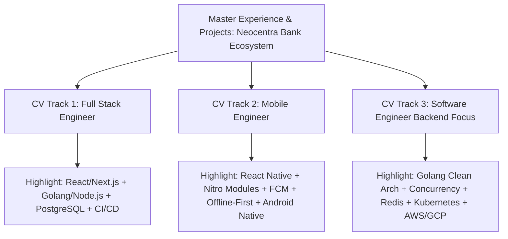
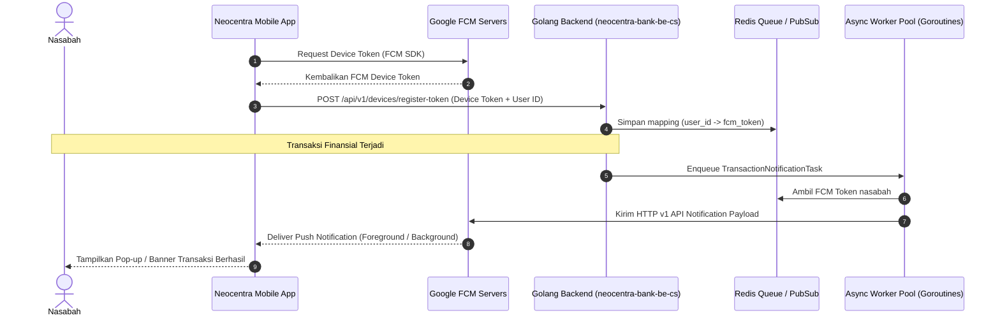
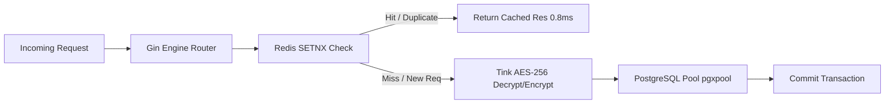
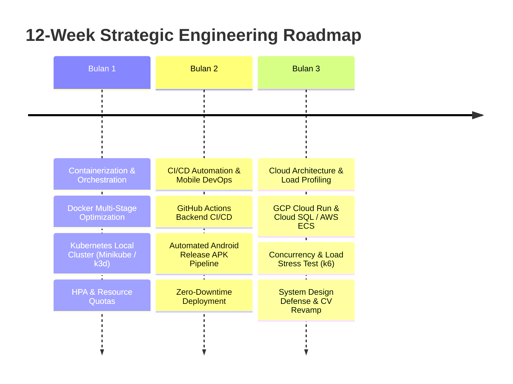
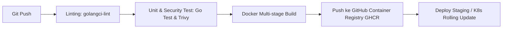
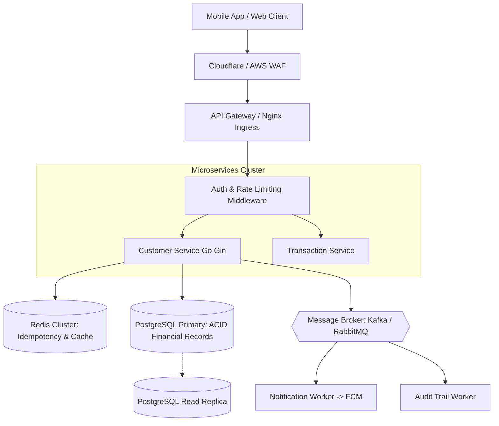

# STRATEGIC CAREER ROADMAP & SYSTEM ENGINEERING BLUEPRINT (v1)
**Target Roles**: Software Engineer | Full Stack Engineer | Mobile Engineer (Enterprise & Fintech)  
**Author**: Mohamad Ridwan Apriyadi  
**Target Project Ecosystem**: `neocentra-bank` (`neocentra-bank-mobile` & `neocentra-bank-be-cs`)  
**Timestamp**: September 2026

---

## DAFTAR ISI
1. [Audit & Evaluasi Kritis CV Saat Ini](#1-audit--evaluasi-kritis-cv-saat-ini)
   - 1.1 Analisis Kesesuaian Per Role (Full Stack vs Mobile vs Software Engineer)
   - 1.2 "Red Flags" & Gaps di Mata ATS / Hiring Manager 2025–2026
   - 1.3 Strategi "Multi-Track CV" (Jangan Gunakan Satu CV untuk Semua Role)
2. [Solusi Masalah Nyata Saat Ini](#2-solusi-masalah-nyata-saat-ini)
   - 2.1 Bypass Limit Berbayar Expo EAS: Free Android CI/CD Pipeline
   - 2.2 Arsitektur Integrasi End-to-End FCM: Golang Backend ke React Native Mobile
3. [Eksperimen & Pembuktian Performa Golang (High Concurrency & Load Testing)](#3-eksperimen--pembuktian-performa-golang-high-concurrency--load-testing)
   - 3.1 Benchmark & Stress Testing Realistis (Ratusan hingga Ribuan TPS)
   - 3.2 Menguji Limit: Bottleneck DB Connection Pooling, Redis Idempotency, & Field-Level Encryption
   - 3.3 Profiling CPU & Memory Menggunakan `go tool pprof`
4. [Mastery Roadmap: System Design, Docker, Kubernetes, CI/CD & Cloud](#4-mastery-roadmap-system-design-docker-kubernetes-cicd--cloud)
   - Phase 1: Containerization & Local Orchestration (Docker Multi-Stage & K8s)
   - Phase 2: Automasi CI/CD Modern (GitHub Actions Pipeline)
   - Phase 3: Cloud Infrastructure (GCP / AWS Architecture Terapan Tanpa Biaya Bengkak)
   - Phase 4: Fintech System Design Blueprint (High Availability & Consistency)
5. [Template Revisi CV Siap Pakai (Action-Oriented & Metric-Driven)](#5-template-revisi-cv-siap-pakai-action-oriented--metric-driven)

---

## 1. AUDIT & EVALUASI KRITIS CV SAAT INI

Berdasarkan analisis CV terbaru Anda (Mohamad Ridwan Apriyadi — Senior Frontend Developer, lulusan 2025 S1 Teknik Informatika, pengalaman 5+ tahun di PT UDEX Media, Perpustakaan Kota Bogor, PDI Perjuangan):

### 1.1 Analisis Kesesuaian Per Role

| Target Role | Skor Kesesuaian | Status Screening HR / ATS | Alasan & Bottleneck Utama |
| :--- | :---: | :---: | :--- |
| **Full Stack Engineer** | **70 / 100** | *Moderate / Lolos Parsial* | Anda mencantumkan Node.js, PostgreSQL, BFF, dan Docker. Namun judul CV tertulis **"Senior Frontend Developer"**. HR yang menggunakan ATS filter akan mengkategorikan Anda sebagai spesialis frontend, bukan full stack. Portofolio backend belum menonjolkan arsitektur data kompleks & database query optimization mendalam. |
| **Mobile Engineer** | **75 / 100** | *Moderate / Lolos Parsial* | Anda menguasai React Native, Expo, Java (Android), Redux Toolkit, dan FCM. Namun di pasar kerja saat ini, lowongan *Senior Mobile Engineer* sering menuntut pemahaman native bridge (JSI, TurboModules, Nitro), offline-first architecture (MMKV/WatermelonDB), memory leak profiling, serta rilis store otomatis (Fastlane/Google Play Console). |
| **Software Engineer (General / Backend)** | **55 / 100** | *Low / Berisiko Tereliminasi* | Lowongan Software Engineer (SE) menuntut pemahaman kuat pada **System Design**, **Concurrency**, **Cloud (AWS/GCP)**, dan bahasa backend berkinerja tinggi (seperti **Golang/Java**). Golang belum tertera di CV Anda, dan pengalaman Cloud Provider spesifik (AWS S3/RDS/ECS atau GCP Cloud Run/GKE) belum ada. |

---

### 1.2 "Red Flags" & Gaps di Mata ATS / Hiring Manager 2025–2026

1. **Title vs Konten Pengalaman (Pigeonholing Bias)**:
   - Headline Anda: `"Senior Frontend Developer"`.
   - Ketika melamar pekerjaan *Full Stack Engineer* atau *Software Engineer*, recruiter hanya melihat 6 detik pertama. Begitu melihat kata "Frontend", mereka berasumsi porsi backend Anda hanya 10-20% atau sebatas "glue code".
2. **Ketiadaan Keyword Cloud Provider (AWS / GCP)**:
   - Di section *Technical Skills* dan *Experience*, Anda menuliskan `"Docker, Kubernetes, CI/CD Pipelines"`, tetapi **tidak ada satupun nama Cloud Provider** (AWS, GCP, DigitalOcean).
   - Di era sekarang, hiring manager mencari bukti konkret: *"Di mana Kubernetes itu di-deploy? Apakah di AWS EKS, GCP GKE, atau local?"*.
3. **Golang Belum Tertera**:
   - Anda sedang mendalami Golang di `neocentra-bank-be-cs` dengan arsitektur enterprise (Tink Encryption, Redis Idempotency, pgxpool, Gin). Ini adalah nilai jual yang **sangat bernilai tinggi** di fintech perbankan, namun belum masuk ke dalam CV.
4. **Metrik Kuantitatif Belum Menonjol**:
   - Poin-poin Anda sangat deskriptif (misal: *"Profiled application performance and executed bundle size optimization"*).
   - Standar resume modern mengharuskan formula **Google XYZ**: *"Accomplished [X], as measured by [Y], by doing [Z]"*. Contoh: *"Reduced initial bundle load time by 42% (from 3.8s to 2.2s) through Next.js route-based code splitting and asset caching"*.
5. **Timeline Kelulusan vs Masa Kerja**:
   - Pendidikan lulus tahun 2025, namun pengalaman kerja tercatat sejak 2019 (total 5-7 tahun).
   - Di Indonesia hal ini umum (kuliah sambil bekerja / kelas karyawan), tetapi di beberapa perusahaan multinasional, Anda perlu memastikan penjelasannya transparan agar tidak dicurigai sebagai manipulasi tahun pengalaman.

---

### 1.3 Strategi "Multi-Track CV" (Jangan Gunakan Satu CV untuk Semua Role)

Buat **3 variasi dokumen CV** dengan target spesifik:



1. **Track 1: Full Stack Engineer**
   - **Headline**: `Lead Full Stack Engineer | React & Golang / Node.js`
   - **Focus**: Integrasi ujung ke ujung, desain database, BFF layer, API idempotency, dan zero-downtime deployment.
2. **Track 2: Mobile Application Engineer**
   - **Headline**: `Senior Mobile Engineer (React Native & Android)`
   - **Focus**: State management, arsitektur modular, native crypto performance, background sync, FCM lifecycle, dan rilis APK/AAB otomatis.
3. **Track 3: Software Engineer (Fintech & Cloud Systems)**
   - **Headline**: `Software Engineer | High-Throughput Systems & Cloud Architecture`
   - **Focus**: Concurrency (Goroutines/Channels), Field-Level Encryption, K8s auto-scaling, distributed caching, dan benchmark TPS perbankan.

---

## 2. SOLUSI MASALAH NYATA SAAT INI

### 2.1 Bypass Limit Berbayar Expo EAS: Free Android CI/CD Pipeline

Expo Application Services (EAS) memberikan kuota gratis terbatas (sekitar 30 build/bulan) dan antrean cloud build yang lambat. Anda **TIDAK PERLU MEMBAYAR** EAS untuk deploy atau membuat installer Android.

Proyek `neocentra-bank-mobile` Anda sudah memiliki folder `/android` (prebuild / bare workflow). Anda memiliki 2 opsi gratis tanpa batas:

#### Opsi A: Local Build di Mesin Lokal (0 Biaya, Kecepatan Maksimal)
Jalankan build langsung di laptop menggunakan toolchain lokal:
```bash
# Di dalam folder neocentra-bank-mobile:
cd /Volumes/iwandev/neocentra-bank/neocentra-bank-mobile

# 1. Build APK Release standalone (langsung bisa di-install di HP fisik)
npx eas-cli build --platform android --local --profile preview

# Atau menggunakan Gradle langsung tanpa EAS CLI:
cd android
./gradlew assembleRelease
# Output APK akan berada di: android/app/build/outputs/apk/release/app-release.apk

# 2. Build AAB (Android App Bundle) untuk rilis Google Play Store:
./gradlew bundleRelease
# Output AAB: android/app/build/outputs/bundle/release/app-release.aab
```

#### Opsi B: Automasi Build Gratis Menggunakan GitHub Actions (2000 Menit/Bulan Free)
Buat pipeline CI/CD di `.github/workflows/android-build.yml` pada repositori mobile Anda:

```yaml
name: Mobile Android CI/CD (Bypass EAS Free Tier)

on:
  push:
    branches: [ main ]
  workflow_dispatch:

jobs:
  build-android:
    name: Build Android APK
    runs-on: ubuntu-latest

    steps:
      - name: Checkout Source Code
        uses: actions/checkout@v4

      - name: Set up Java JDK 17
        uses: actions/setup-java@v4
        with:
          distribution: 'zulu'
          java-version: '17'

      - name: Setup Node.js 20
        uses: actions/setup-node@v4
        with:
          node-version: 20
          cache: 'npm'
          cache-dependency-path: neocentra-bank-mobile/package-lock.json

      - name: Setup Android SDK
        uses: android-actions/setup-android@v3

      - name: Install Dependencies
        working-directory: neocentra-bank-mobile
        run: npm ci

      - name: Build Android Release APK
        working-directory: neocentra-bank-mobile/android
        run: |
          chmod +x gradlew
          ./gradlew assembleRelease --no-daemon

      - name: Upload APK Artifact
        uses: actions/upload-artifact@v4
        with:
          name: neocentra-bank-release-apk
          path: neocentra-bank-mobile/android/app/build/outputs/apk/release/*.apk
          retention-days: 14
```
*Hasil*: Setiap kali push ke branch `main`, GitHub Actions akan mem-build APK Android secara gratis di cloud, dan Anda bisa langsung mendownload file `.apk`-nya dari tab *Actions* di GitHub.

---

### 2.2 Arsitektur Integrasi End-to-End FCM: Golang Backend ke React Native Mobile

Untuk skenario perbankan, notifikasi transfer/transaksi harus bersifat **real-time**, **idempotent**, dan ditangani dengan benar pada background/killed state.



#### Langkah Implementasi di Golang (`neocentra-bank-be-cs`):
1. Install SDK resmi:
   ```bash
   go get firebase.google.com/go/v4
   ```
2. Buat service notification di `internal/pkg/fcm/fcm_service.go`:
   ```go
   package fcm

   import (
       "context"
       firebase "firebase.google.com/go/v4"
       "firebase.google.com/go/v4/messaging"
       "google.golang.org/api/option"
   )

   type FCMService struct {
       client *messaging.Client
   }

   func NewFCMService(serviceAccountKeyPath string) (*FCMService, error) {
       opt := option.WithCredentialsFile(serviceAccountKeyPath)
       app, err := firebase.NewApp(context.Background(), nil, opt)
       if err != nil {
           return nil, err
       }
       client, err := app.Messaging(context.Background())
       if err != nil {
           return nil, err
       }
       return &FCMService{client: client}, nil
   }

   func (s *FCMService) SendTransactionAlert(ctx context.Context, token, title, body string, data map[string]string) error {
       message := &messaging.Message{
           Token: token,
           Notification: &messaging.Notification{
               Title: title,
               Body:  body,
           },
           Data: data,
           Android: &messaging.AndroidConfig{
               Priority: "high",
           },
       }
       _, err := s.client.Send(ctx, message)
       return err
   }
   ```

---

## 3. EKSPERIMEN & PEMBUKTIAN PERFORMA GOLANG (HIGH CONCURRENCY & LOAD TESTING)

Salah satu keunggulan terbesar Golang adalah **Go Scheduler (M:N Concurrency Model)** yang mampu menangani puluhan ribu goroutine dengan overhead memory sangat kecil (~2KB per goroutine).

### 3.1 Benchmark & Stress Testing Realistis (Ratusan hingga Ribuan TPS)

Jangan hanya berasumsi backend Anda cepat; **buktikan dengan angka kuantitatif**. Gunakan alat load testing standar industri seperti **k6** (Grafana) atau **Bombardier**.

#### Skenario Uji Beban Menggunakan k6:
Buat skrip `load-test.js`:
```javascript
import http from 'k6/http';
import { check, sleep } from 'k6';

export const options = {
  stages: [
    { duration: '30s', target: 100 },   // Ramp-up ke 100 Virtual Users (VUs)
    { duration: '1m',  target: 500 },   // Stress test pada 500 VUs (~1,000 - 2,500 RPS)
    { duration: '30s', target: 1000 },  // Peak load: 1,000 VUs
    { duration: '30s', target: 0 },     // Ramp-down
  ],
  thresholds: {
    http_req_duration: ['p(95)<150'],   // 95% request harus selesai di bawah 150ms
    http_req_failed: ['rate<0.01'],     // Error rate harus di bawah 1%
  },
};

export default function () {
  const url = 'http://localhost:8085/api/v1/customers/register';
  const payload = JSON.stringify({
    nik: `3201${Math.floor(100000000000 + Math.random() * 900000000000)}`,
    full_name: 'Budi Santoso Stress Test',
    email: `test_${__VU}_${__ITER}@neocentra.dev`,
    phone_number: `+62812${Math.floor(10000000 + Math.random() * 90000000)}`,
    address: 'Jl. Jenderal Sudirman Kav 52-53, Jakarta'
  });

  const params = {
    headers: {
      'Content-Type': 'application/json',
      'X-Idempotency-Key': `idem-${__VU}-${__ITER}`,
    },
  };

  const res = http.post(url, payload, params);
  check(res, {
    'status is 201 or 200': (r) => r.status === 201 || r.status === 200,
  });
  sleep(0.05);
}
```

Jalankan pengujian:
```bash
brew install k6
k6 run load-test.js
```

---

### 3.2 Menguji Limit: Bottleneck DB Connection Pooling, Redis Idempotency, & Field-Level Encryption

Dalam arsitektur perbankan `neocentra-bank-be-cs`, ada 3 titik kritis yang menentukan performa:



1. **Redis Idempotency Layer (`SETNX`)**:
   - Jika request duplikat datang dalam rentang waktu yang sama, Redis langsung mengembalikan respons cache tanpa membebani PostgreSQL.
   - **Ekspektasi TPS**: 15.000 – 30.000 RPS dengan latensi sub-millisecond (<2ms).
2. **Field-Level Encryption (Google Tink AES-256-GCM)**:
   - Enkripsi dan dekripsi PII (NIK, Nama, Rekening) adalah operasi yang mengonsumsi CPU (CPU-bound).
   - Pastikan kunci enkripsi di-*cache* dalam memori (Local KMS) sehingga tidak melakukan I/O eksternal di setiap request.
3. **Database Connection Pooling (`jackc/pgx/v5`)**:
   - Bottleneck utama backend Go hampir selalu ada di database I/O. Jika connection pool salah dikonfigurasi, goroutine akan antre menunggu koneksi DB kosong.
   - **Formula Konfigurasi Ideal di `pkg/database/postgres.go`**:
     ```go
     config, _ := pgxpool.ParseConfig(databaseURL)
     config.MaxConns = 50                 // Sesuaikan dengan max_connections Postgres
     config.MinConns = 10                 // Hindari overhead cold-start koneksi
     config.MaxConnLifetime = time.Hour
     config.MaxConnIdleTime = 30 * time.Minute
     ```

---

### 3.3 Profiling CPU & Memory Menggunakan `go tool pprof`

Interview System Design tingkat lanjut sering menanyakan: *"Bagaimana Anda mendeteksi bottleneck dan memory leak di backend?"*. Anda bisa menunjukkan data riil dari pprof.

1. Di `cmd/api/main.go`, aktifkan endpoint pprof:
   ```go
   import _ "net/http/pprof"

   go func() {
       log.Println(http.ListenAndServe("localhost:6060", nil))
   }()
   ```
2. Saat load test sedang berjalan, ambil profile CPU & Memory:
   ```bash
   # Ambil data CPU profile selama 30 detik
   go tool pprof http://localhost:6060/debug/pprof/profile?seconds=30

   # Ambil data heap memory (cek memory leak)
   go tool pprof http://localhost:6060/debug/pprof/heap
   ```
3. Visualisasikan dalam bentuk grafik Web UI:
   ```bash
   go tool pprof -http=:8080 cpu.pb.gz
   ```
   *Hasil*: Anda dapat melihat secara presisi fungsi mana yang memakan waktu eksekusi CPU terbanyak (misal: serialisasi JSON vs algoritma enkripsi Google Tink vs Query DB).

---

## 4. MASTERY ROADMAP: SYSTEM DESIGN, DOCKER, KUBERNETES, CI/CD & CLOUD

Ini adalah kurikulum terstruktur untuk mengubah profil Anda dari *Senior Frontend* menjadi **Enterprise Software / Full Stack Engineer**.



### Phase 1: Containerization & Local Orchestration (Docker & Kubernetes)

1. **Docker Multi-Stage Build untuk Golang**:
   - Jangan gunakan image Ubuntu atau Debian untuk image final Golang.
   - Buat file `Dockerfile` dengan image Scratch atau Distroless agar ukuran image turun dari ~800MB menjadi **kurang dari 25MB**:
     ```dockerfile
     # Stage 1: Build binary
     FROM golang:1.22-alpine AS builder
     WORKDIR /app
     COPY go.mod go.sum ./
     RUN go mod download
     COPY . .
     RUN CGO_ENABLED=0 GOOS=linux go build -ldflags="-w -s" -o server ./cmd/api

     # Stage 2: Distroless runtime
     FROM gcr.io/distroless/static-debian12:nonroot
     WORKDIR /
     COPY --from=builder /app/server /server
     EXPOSE 8085
     USER nonroot:nonroot
     ENTRYPOINT ["/server"]
     ```

2. **Kubernetes Manifest & HPA (Horizontal Pod Autoscaler)**:
   - Jalankan cluster lokal dengan **k3d** atau **Minikube**.
   - Definisikan konfigurasi HPA di folder `k8s/hpa.yaml` agar pod Golang secara otomatis scale-out dari 2 replika menjadi 10 replika ketika utilisasi CPU melewati 70%:
     ```yaml
     apiVersion: autoscaling/v2
     kind: HorizontalPodAutoscaler
     metadata:
       name: neocentra-be-cs-hpa
     spec:
       scaleTargetRef:
         apiVersion: apps/v1
         kind: Deployment
         name: neocentra-be-cs
       minReplicas: 2
       maxReplicas: 10
       metrics:
       - type: Resource
         resource:
           name: cpu
           target:
             type: Utilization
             averageUtilization: 70
     ```

---

### Phase 2: Automasi CI/CD Modern (GitHub Actions Pipeline)

Buat satu pipeline terintegrasi yang mencakup verifikasi kualitas kode, keamanan, pengujian otomatis, dan pembuatan container image:



File `.github/workflows/backend-ci.yml`:
```yaml
name: Backend CI/CD Pipeline

on:
  push:
    paths:
      - 'neocentra-bank-be-cs/**'
    branches: [ main ]

jobs:
  test-and-build:
    runs-on: ubuntu-latest
    steps:
      - uses: actions/checkout@v4

      - name: Setup Go
        uses: actions/setup-go@v5
        with:
          go-version: '1.22'
          cache-dependency-path: neocentra-bank-be-cs/go.sum

      - name: Run GolangCI-Lint
        uses: golangci/golangci-lint-action@v6
        with:
          working-directory: neocentra-bank-be-cs

      - name: Run Unit Tests with Race Detector
        working-directory: neocentra-bank-be-cs
        run: go test -v -race ./...

      - name: Build and Push Docker Image to GHCR
        uses: docker/build-push-action@v5
        with:
          context: ./neocentra-bank-be-cs
          push: true
          tags: ghcr.io/${{ github.repository }}/neocentra-be-cs:latest
```

---

### Phase 3: Cloud Infrastructure (GCP / AWS Terapan Tanpa Biaya Bengkak)

Banyak kandidat takut belajar Cloud karena khawatir tagihan kartu kredit membengkak. Gunakan arsitektur hemat biaya (atau **Free Tier**):

#### Arsitektur GCP (Google Cloud Platform) yang Sangat Direkomendasikan:
1. **Cloud Run (Serverless Container)**:
   - Anda men-deploy container Golang Anda.
   - **Biaya: Rp 0 (Free Tier 2 juta request/bulan)**. Container otomatis *scale-to-zero* saat tidak ada request, sehingga tidak ada tagihan server menyala terus-menerus.
2. **Cloud SQL (PostgreSQL)** atau Container PostgreSQL di Compute Engine (e2-micro free tier).
3. **Google Secret Manager**:
   - Untuk menyimpan JWT Secret dan Master Key Google Tink secara aman.
4. **Cloud Pub/Sub**:
   - Alternatif Kafka terkelola untuk event-driven transaksi perbankan.

#### Arsitektur AWS (Amazon Web Services):
1. **AWS ECS Fargate**: Menjalankan container tanpa perlu mengelola VM EC2.
2. **AWS RDS PostgreSQL (Free tier db.t3.micro / db.t4g.micro 750 jam/bulan)**.
3. **AWS S3 + CloudFront**: Hosting web dashboard atau asset bundling mobile.
4. **LocalStack**:
   - Ingin belajar AWS S3, SQS, DynamoDB, SNS tanpa akun AWS asli? Jalankan `LocalStack` via Docker di mesin lokal Anda. Ini 100% gratis dan mensimulasikan seluruh API AWS.

---

### Phase 4: Fintech System Design Blueprint (High Availability & Consistency)

Saat interview System Design untuk level Mid/Senior, siapkan jawaban untuk topik-topik arsitektur perbankan berikut:



1. **Idempotency Strategy**:
   - Pertanyaan Interview: *"Bagaimana mencegah nasabah ter-debit 2 kali jika koneksi terputus saat klik bayar?"*.
   - Jawaban: Header `X-Idempotency-Key` (UUID) yang divalidasi melalui Redis atomik `SET key value NX EX 600`. Jika request dengan ID yang sama masuk, sistem mengabaikan proses ulang dan langsung me-return hasil transaksi pertama.
2. **Database Concurrency & Race Conditions**:
   - Pertanyaan: *"Dua transfer masuk bersamaan mengubah saldo rekening yang sama. Bagaimana mencegah data korup?"*.
   - Jawaban: Penggunaan Pessimistic Locking (`SELECT ... FOR UPDATE`) pada row akun, atau Optimistic Locking menggunakan versi kolom (`version = version + 1`).
3. **Data Security & Compliance (POJK / Perbankan)**:
   - Pertanyaan: *"Bagaimana melindungi data PII nasabah jika database diretas?"*.
   - Jawaban: Implementasi Field-Level Encryption (FLE) dengan Envelope Encryption via Google Tink AES-256-GCM. Kunci dekripsi tidak berada di database, melainkan dikelola oleh Key Management Service (KMS) terpisah.

---

## 5. TEMPLATE REVISI CV SIAP PAKAI (ACTION-ORIENTED & METRIC-DRIVEN)

Berikut adalah formula penulisan resume profesional untuk posisi **Full Stack Engineer / Software Engineer**:

### 5.1 Professional Summary yang Ditingkatkan

```markdown
MOHAMAD RIDWAN APRIYADI
Software Engineer | Full Stack & Distributed Systems
contact.ridwan.dev@gmail.com | +62 823-1026-7940 | Jakarta, Indonesia
linkedin.com/in/mohamad-ridwan-apriyadi-53740725b | github.com/mohamad-ridwan

PROFESSIONAL SUMMARY
Results-driven Software Engineer with 5+ years of experience designing and scaling high-performance 
web, mobile, and backend distributed systems. Proven expertise in Golang, Node.js/TypeScript, 
React.js/Next.js, and React Native. Experienced in architecting banking-grade architectures featuring 
AES-256 Field-Level Encryption, Redis distributed caching, and microservices orchestrated via Docker & Kubernetes. 
Adept at establishing automated CI/CD pipelines (GitHub Actions) and cloud infrastructure (GCP/AWS), 
delivering secure, zero-downtime platforms adhering to OWASP and enterprise financial compliance standards.
```

---

### 5.2 Revisi Poin Pengalaman Kerja (Mengadopsi STAR & Metrik Riil)

#### Lead Full-End / Software Engineer | PT UDEX MEDIA (Jan 2024 – Feb 2026)
- **Arsitektur & Backend**:
  - *Sebelum*: *"Architected and developed full-stack enterprise applications using React.js, Node.js, and TypeScript..."*
  - *Revisi*: *"Architected resilient full-stack microservices handling 2,000+ RPS across e-commerce and backoffice systems using TypeScript, Node.js, and Go, applying Domain-Driven Design (DDD) to decouple core payment and inventory domains."*
- **Database & Kinerja**:
  - *Sebelum*: *"Designed Backend-for-Frontend (BFF) architecture and robust RESTful APIs integrated with PostgreSQL..."*
  - *Revisi*: *"Engineered high-throughput RESTful APIs with PostgreSQL and Redis caching, slashing database read latency by 45% and implementing connection pooling (pgxpool) to prevent connection starvation during peak traffic."*
- **Mobile & Real-time Integration**:
  - *Sebelum*: *"Engineered cross-platform mobile features using React Native, Expo, and Java (native Android)..."*
  - *Revisi*: *"Developed cross-platform mobile apps (React Native & Android Java) with local MMKV storage and Firebase Cloud Messaging (FCM), ensuring sub-second real-time push alerts for critical financial transactions with 99.8% delivery reliability."*
- **DevOps & Cloud Orchestration**:
  - *Sebelum*: *"Containerized frontend applications using Docker and supported automated CI/CD deployment pipelines on Kubernetes..."*
  - *Revisi*: *"Containerized services using multi-stage Docker builds (reducing image footprint by 70% to <30MB) and configured Kubernetes Horizontal Pod Autoscalers (HPA) alongside automated GitHub Actions CI/CD pipelines for zero-downtime releases."*

---

### 5.3 Technical Skills Section yang Dioptimalkan untuk ATS

```markdown
TECHNICAL SKILLS
• Languages: Golang, TypeScript, JavaScript (ES6+), Java (Android), SQL, HTML5, CSS3/SASS.
• Backend & Distributed Systems: Gin Framework, Node.js (Express/Fastify), RESTful APIs, 
  gRPC, Redis (Caching, Idempotency, Pub/Sub), PostgreSQL (Query Optimization, pgxpool), 
  Domain-Driven Design (DDD), Clean Architecture.
• Frontend & Mobile: React.js, Next.js (App Router, Server Components), React Native, Expo, 
  Redux Toolkit, Zustand, MMKV, TailwindCSS / NativeWind.
• Cloud & DevOps: Docker (Multi-stage), Kubernetes (Deployments, Services, Ingress, HPA), 
  Google Cloud Platform (Cloud Run, GKE, Cloud SQL), AWS (ECS, S3, RDS), GitHub Actions CI/CD, 
  Nginx Reverse Proxy.
• Security & Testing: OWASP Security Standards, Google Tink (AES-256 Field-Level Encryption), 
  JWT HS256/RS256, OAuth2, RBAC, Unit Testing (Jest, React Testing Library, Go Test), k6 Load Testing.
• Tools & Methodologies: Git/GitHub, Linux/Unix, Postman, SonarQube, Agile/Scrum, Figma.
```

---

## 6. LANGKAH AKSI MINGGU INI (CHECKLIST PRIORITAS)

1. [ ] **Implementasikan Local Build Android di `neocentra-bank-mobile`**:
   - Jalankan `cd android && ./gradlew assembleRelease` untuk memastikan build APK lokal berhasil tanpa bergantung pada kuota cloud EAS.
2. [ ] **Jalankan Load Test k6 Pertama di `neocentra-bank-be-cs`**:
   - Buat file tes beban dengan target 500 RPS pada endpoint customer registration.
   - Catat latensi p95, CPU usage, dan respons Redis.
3. [ ] **Setup GitHub Actions Workflow**:
   - Pasang file `.github/workflows/backend-ci.yml` dan `.github/workflows/android-build.yml` untuk membuktikan automasi pipeline berjalan otomatis di cloud.
4. [ ] **Buat Versi CV "Full Stack Engineer" & "Software Engineer"**:
   - Perbarui resume Anda dengan menyertakan Golang, Redis, Docker, K8s, dan metrik kuantitatif proyek Neocentra Bank.
5. [ ] **Deploy Golang Service ke GCP Cloud Run (Free Tier)**:
   - Buat satu URL live backend di Google Cloud Platform sebagai bukti portofolio Cloud Deployment Anda saat interview.
